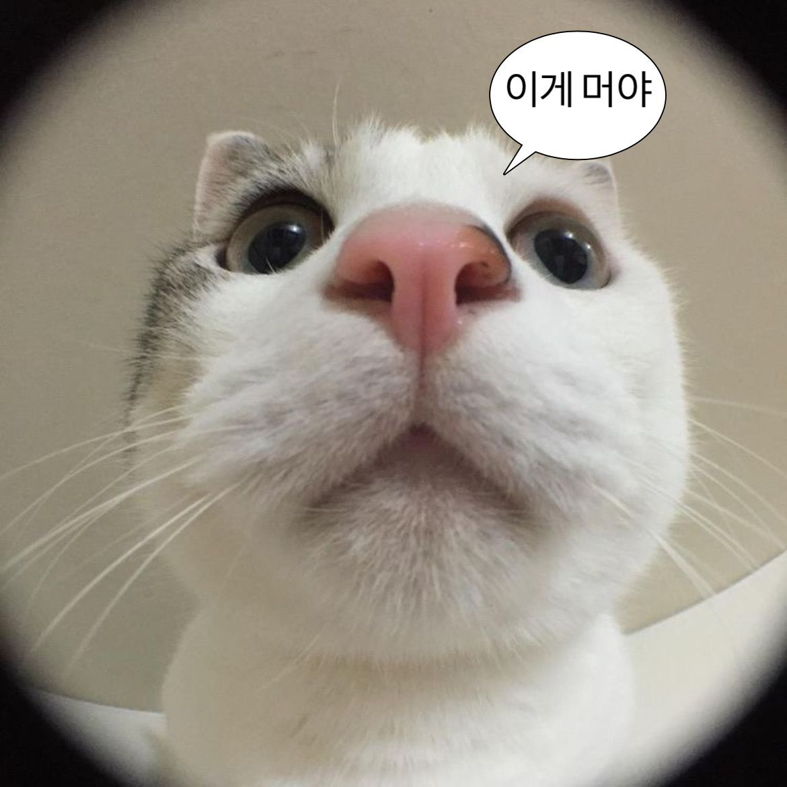

# hello-world
2025-01-21 //test repository
  [돌아가기](https://rustylake.github.io) 
# markdown language
 1. 순서1
 2. 순서2
 3. 순서3

# title
 * 메뉴1
    + 서브메뉴1
      - 서브서브메뉴1

## sub title
### 3rd title
- item1
- item2
- item3

## hi, this is test.
 
## book_mark
 [네이버](https://naver.com) 
 [구글](https://google.com) 
## 고양이 동영상
<iframe width="356" height="633" src="https://www.youtube.com/embed/rA8CkSDk1CA" title="가나다랴!므아 그만해!! 내가 왜.." frameborder="0" allow="accelerometer; autoplay; clipboard-write; encrypted-media; gyroscope; picture-in-picture; web-share" referrerpolicy="strict-origin-when-cross-origin" allowfullscreen></iframe>
